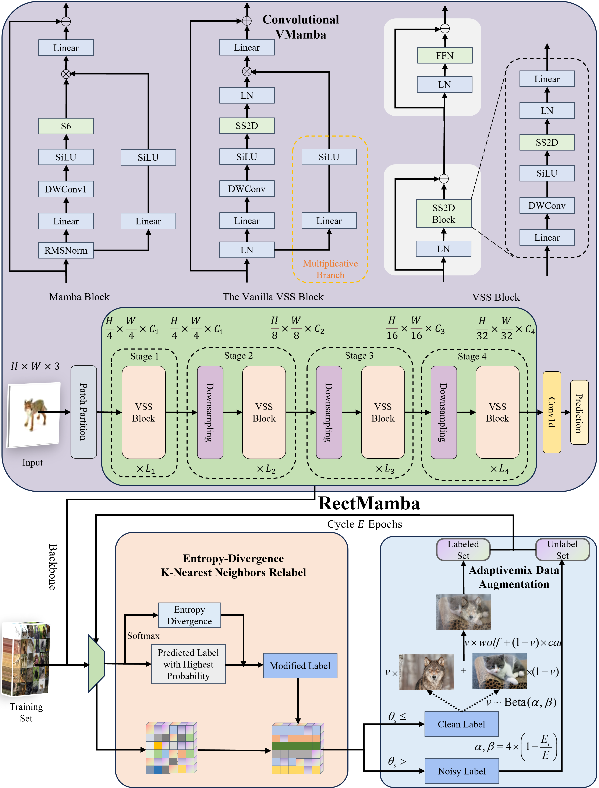
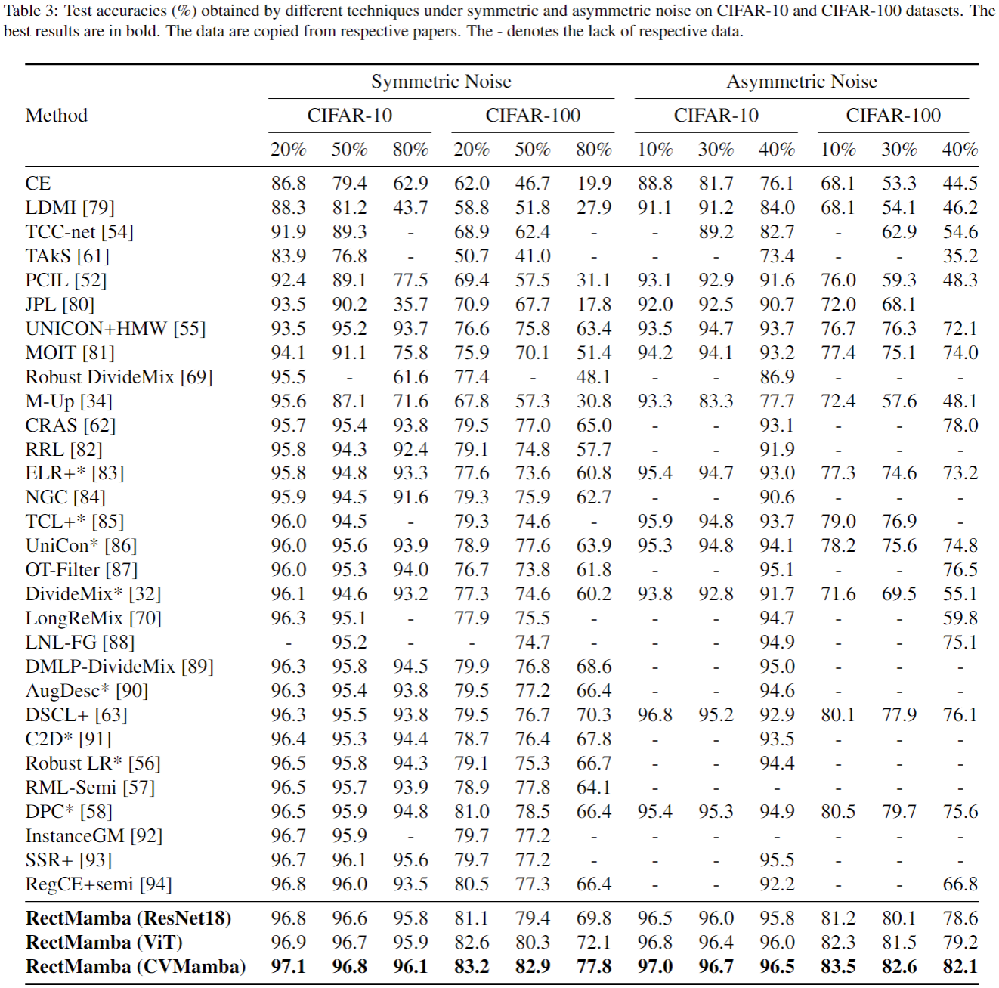

# RectMamba: Exploring State Space Models with Entropy-Divergence Framework for Noisy Label Rectification

This repository contains the code and model weights for the **RectMamba** architecture, which introduces an Entropy-Divergence K-Nearest Neighbors Relabel (EDKR) method for correcting noisy labels and an adaptivemix data augmentation strategy. This method is built on **V-Mamba**, which leverages Convolutional Networks (ConvNet) and Vision Transformer (ViT) blocks for feature extraction and processing.

## Table of Contents
- [Installation](#installation)
- [Requirements](#requirements)
- [Model Architecture](#model-architecture)
- [Training & Testing](#training-testing)
- [File Structure](#file-structure)

## Installation

To install the necessary environment for running the code, you can clone the repository and install the required dependencies.

```bash
git clone https://github.com/ningwei-wang/RectMamba.git
cd RectMamba
```

Install the required Python packages using `pip`:

```bash
pip install -r requirements.txt
```

### VMamba Installation

RectMamba utilizes **V-Mamba** as a backbone for its architecture. You can install the official VMamba repository using:

```bash
git clone https://github.com/MzeroMiko/VMamba.git
cd VMamba
pip install -e .
```

For more detailed installation instructions, please refer to the official VMamba repository [here](https://github.com/MzeroMiko/VMamba).

## Requirements

- Python 3.8+
- PyTorch 1.10.0+
- NVIDIA CUDA 11.0+ (if using GPU)
- Other dependencies are listed in `requirements.txt`

## Model Architecture

The RectMamba architecture integrates a V-Mamba backbone with several advanced strategies for handling noisy labels. Below is an illustration of the overall architecture:




The key components of the architecture include:
- **Convolutional VMamba Blocks**: These blocks are responsible for extracting hierarchical features from the input images. They use depthwise separable convolutions and Vision Support Structure (VSS) blocks for efficient feature extraction.
- **Entropy-Divergence K-Nearest Neighbors Relabel (EDKR)**: This module dynamically corrects noisy labels by computing the entropy divergence and applying label correction based on the k-nearest neighbors in the feature space.
- **Adaptivemix Data Augmentation**: This module generates mixed examples based on clean and noisy labels to enhance the robustness of the model to label noise.

### Detailed Components
- **Mamba Block**: This block is built with a depthwise separable convolution followed by SiLU activations.
- **VSS Blocks**: These blocks help in extracting multi-scale features from the input, and their multiplicative branch enhances the representational capacity of the model.
- **EDKR**: Computes entropy divergence to determine the confidence level of a label and relabels samples that are likely noisy based on nearest neighbors.
- **Adaptivemix**: An augmentation strategy that mixes samples from clean and noisy datasets based on a dynamic β-distribution.

## Training Testing

To train the model on your dataset, you can run the following command:

```bash
python cifar 10.py --dataset_path /path/to/cifar 10 \
               --noisy_dataset_path /data/data/noisy \
               --noise_mode sym \
               --noise_ratio 0.3 \
               --k 200 \
               --epochs 50 \
               --lr 0.001 \
```

Please ensure that your dataset is properly formatted and placed in the `data/` directory. You can modify the training configuration in the provided YAML files.




## File Structure

The repository is organized as follows:

```
RectMamba/ 
│          
├── utils/                  # Configuration files for training and testing    
├── datasets/                     # Directory for datasets        
├── kernels/                     # Kernels       
├── mamba-1p1p1/        # mamba tools     
├── models_vmamba/        # vmamba package   
├── models/                   # Directory containing the RectMamba model architecture    
├── pretrained/                  # Pretrained weights directory      
├── wandb/                  # Results directory for saving outputs    
├── cifar 10.py                  # Script for training & testing the model    
├── requirements.txt          # Required Python dependencies    
├── README.md                 # Project readme  
```


